# Knowledge Base Topic Index

Central entry point and cross-linked topic catalog for project documentation:

## Knowledge Graph & Topic Map

```mermaid
flowchart TD
    INDEX["Knowledge Base (INDEX)"]
    T_ARCHITECTURE["System Architecture & Compilation Pipeline"]
    INDEX --> T_ARCHITECTURE
    T_CSHARP_SCRIPT_EVALUATION["Roslyn C# Script Compilation & Dynamic Evaluation"]
    INDEX --> T_CSHARP_SCRIPT_EVALUATION
    T_DOMAIN_MODEL["Domain Model & Vocabulary"]
    INDEX --> T_DOMAIN_MODEL
    T_RUNTIME_STRING_INTERPOLATION["Runtime C# String Interpolation Engine"]
    INDEX --> T_RUNTIME_STRING_INTERPOLATION
    T_SETUP_AND_WORKFLOW["Setup, Configuration & Developer Workflow"]
    INDEX --> T_SETUP_AND_WORKFLOW
    T_ARCHITECTURE -.->|references| T_RUNTIME_STRING_INTERPOLATION
    T_ARCHITECTURE -.->|references| T_CSHARP_SCRIPT_EVALUATION
```

---

## Articles

- **[System Architecture & Compilation Pipeline](./topic--architecture.md)** (architecture) `architecture`, `roslyn`, `scripting`, `compilation-pipeline`, `template-engine`
- **[Roslyn C# Script Compilation & Dynamic Evaluation](./topic--csharp-script-evaluation.md)** (topic) `emitron`, `roslyn`, `scripting`, `compilation`, `evaluation`, `assemblies`, `usings`
- **[Domain Model & Vocabulary](./topic--domain-model.md)** (domain-model) `domain-model`, `entities`, `options`, `compilation`, `parameters`
- **[Runtime C# String Interpolation Engine](./topic--runtime-string-interpolation.md)** (topic) `emitron`, `string-interpolation`, `templates`, `roslyn`, `runtime-compilation`, `formatting`
- **[Setup, Configuration & Developer Workflow](./topic--setup-and-workflow.md)** (setup-workflow) `setup`, `workflow`, `testing`, `nuget`, `roslyn`

---

## Related Context

- [AGENTS.md](../AGENTS.md): Active protocol conventions and rules.
- [.along/DECISIONS.md](../.along/DECISIONS.md): Architectural Decision Records.
- [.along/ISSUES.md](../.along/ISSUES.md): Active issue tracking board.
- [.along/HISTORY.md](../.along/HISTORY.md): Append-only project history log.
