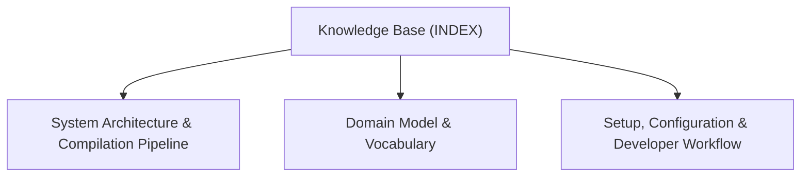

# ActDim.Emitron - Knowledge Base Topic Index

Central entry point and cross-linked topic catalog for project documentation:

## Knowledge Graph & Topic Map

```mermaid
flowchart TD
    INDEX["Knowledge Base (INDEX)"]
    T_ARCHITECTURE["System Architecture & Compilation Pipeline"]
    INDEX --> T_ARCHITECTURE
    T_DOMAIN_MODEL["Domain Model & Vocabulary"]
    INDEX --> T_DOMAIN_MODEL
    T_SETUP_AND_WORKFLOW["Setup, Configuration & Developer Workflow"]
    INDEX --> T_SETUP_AND_WORKFLOW
```

---

## Articles

- **[System Architecture & Compilation Pipeline](./topic--architecture.md)** (architecture) `architecture`, `roslyn`, `scripting`, `compilation-pipeline`, `template-engine`
- **[Domain Model & Vocabulary](./topic--domain-model.md)** (domain-model) `domain-model`, `entities`, `options`, `compilation`, `parameters`
- **[Setup, Configuration & Developer Workflow](./topic--setup-and-workflow.md)** (setup-workflow) `setup`, `workflow`, `testing`, `nuget`, `roslyn`

---

## Related Context

- [AGENTS.md](../AGENTS.md): Active protocol conventions and rules.
- [.along/DECISIONS.md](../.along/DECISIONS.md): Architectural Decision Records.
- [Domain Model & Entity Ecosystem](./topic--domain-model.md): Specifications for active issues and project history.
