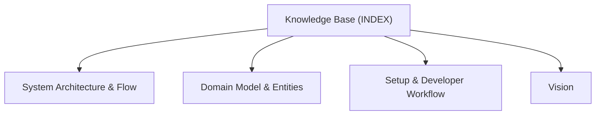

# ActDim.Observability - Knowledge Base Topic Index

Central entry point and cross-linked topic catalog for project documentation:

## Knowledge Graph & Topic Map

---

## Articles

- **[System Architecture & Flow](./topic--architecture.md)** (architecture) `architecture`
- **[Domain Model & Entities](./topic--domain-model.md)** (domain-model) `domain-model`
- **[Setup & Developer Workflow](./topic--setup-and-workflow.md)** (setup-workflow) `setup-workflow`
- **[Vision](./topic--vision.md)** (topic) `vision`

---

## Related Context

- [Domain Model & Entity Ecosystem](./topic--domain-model.md): Specifications for active issues and project history.
