# Knowledge Base Topic Index

Central entry point and cross-linked topic catalog for project documentation:

## Knowledge Graph & Topic Map

```mermaid
flowchart TD
    INDEX["Knowledge Base (INDEX)"]
    T_AMBIENT_CONTEXT["Ambient Execution Context"]
    INDEX --> T_AMBIENT_CONTEXT
    T_ARCHITECTURE["System Architecture & Flow"]
    INDEX --> T_ARCHITECTURE
    T_ASYNC_OBJECT_POOL["Asynchronous Bounded Object Pool"]
    INDEX --> T_ASYNC_OBJECT_POOL
    T_CACHING_PROXIES["Resilient Caching Proxies"]
    INDEX --> T_CACHING_PROXIES
    T_COMPRESSION_AND_ARCHIVES["Stream & Payload Compression and Archiving"]
    INDEX --> T_COMPRESSION_AND_ARCHIVES
    T_CONCURRENT_COLLECTIONS["Specialized Concurrent Collections"]
    INDEX --> T_CONCURRENT_COLLECTIONS
    T_DOMAIN_MODEL["Domain Model & Vocabulary"]
    INDEX --> T_DOMAIN_MODEL
    T_EXTENSIONS_AND_UTILITIES["Extensions & Common Utilities"]
    INDEX --> T_EXTENSIONS_AND_UTILITIES
    T_MEMORY_AND_DISPOSAL["Memory Management & Disposal Lifecycle"]
    INDEX --> T_MEMORY_AND_DISPOSAL
    T_RANDOM_ID["Cryptographic Random Identifier Generator"]
    INDEX --> T_RANDOM_ID
    T_SETUP_AND_WORKFLOW["Setup, Installation & Developer Workflows"]
    INDEX --> T_SETUP_AND_WORKFLOW
    T_ARCHITECTURE -.->|references| T_AMBIENT_CONTEXT
    T_ARCHITECTURE -.->|references| T_ASYNC_OBJECT_POOL
    T_ARCHITECTURE -.->|references| T_CACHING_PROXIES
    T_ARCHITECTURE -.->|references| T_COMPRESSION_AND_ARCHIVES
    T_ARCHITECTURE -.->|references| T_CONCURRENT_COLLECTIONS
    T_ARCHITECTURE -.->|references| T_MEMORY_AND_DISPOSAL
    T_ARCHITECTURE -.->|references| T_RANDOM_ID
    T_ARCHITECTURE -.->|references| T_EXTENSIONS_AND_UTILITIES
```

---

## Articles

- **[Ambient Execution Context](./topic--ambient-context.md)** (topic) `context`, `ambient`, `async-local`, `logging`, `dependency-injection`
- **[System Architecture & Flow](./topic--architecture.md)** (architecture) `architecture`, `boundaries`, `subsystems`, `design-patterns`
- **[Asynchronous Bounded Object Pool](./topic--async-object-pool.md)** (topic) `pooling`, `async`, `concurrency`, `object-pool`, `fault-tolerance`, `resource-management`
- **[Resilient Caching Proxies](./topic--caching-proxies.md)** (topic) `caching`, `memory-cache`, `distributed-cache`, `proxy`, `serialization`
- **[Stream & Payload Compression and Archiving](./topic--compression-and-archives.md)** (topic) `compression`, `archiving`, `gzip`, `brotli`, `tar`, `zip`, `zero-allocation`, `buffer-pool`
- **[Specialized Concurrent Collections](./topic--concurrent-collections.md)** (topic) `collections`, `concurrent`, `weak-table`, `composite-key`, `lock-free`
- **[Domain Model & Vocabulary](./topic--domain-model.md)** (domain-model) `domain-model`, `entities`, `contracts`, `error-handling`, `vocabulary`
- **[Extensions & Common Utilities](./topic--extensions-and-utilities.md)** (topic) `extensions`, `streams`, `strings`, `guards`, `random-id`, `utilities`
- **[Memory Management & Disposal Lifecycle](./topic--memory-and-disposal.md)** (topic) `memory`, `buffer`, `array-pool`, `buffer-owner`, `disposal`, `recyclable-stream`, `reachability`
- **[Cryptographic Random Identifier Generator](./topic--random-id.md)** (topic) `random-id`, `identifiers`, `cryptography`, `base62`, `base58`, `crockford-base32`, `collision-resistance`
- **[Setup, Installation & Developer Workflows](./topic--setup-and-workflow.md)** (setup-workflow) `setup`, `workflow`, `testing`, `dependency-injection`, `installation`

---

## Related Context

- [AGENTS.md](../AGENTS.md): Active protocol conventions and rules.
- [.along/DECISIONS.md](../.along/DECISIONS.md): Architectural Decision Records.
- [.along/ISSUES.md](../.along/ISSUES.md): Active issue tracking board.
- [.along/HISTORY.md](../.along/HISTORY.md): Append-only project history log.
