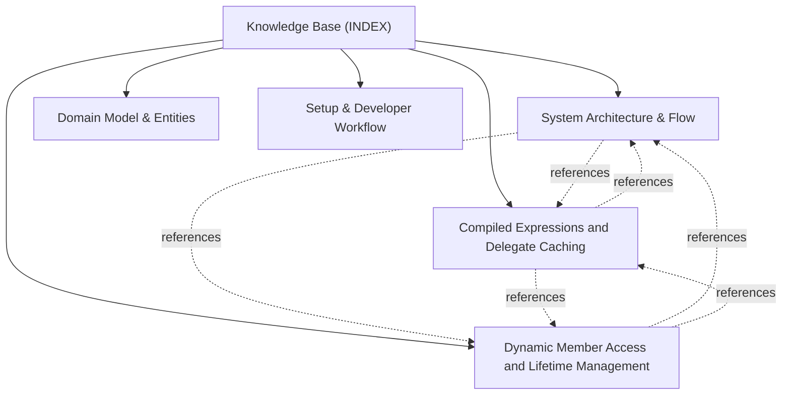

# Knowledge Base Topic Index

Central entry point and cross-linked topic catalog for project documentation:

## Knowledge Graph & Topic Map

---

## Articles

- **[System Architecture & Flow](./topic--architecture.md)** (architecture) `architecture`, `reflection`, `expression-trees`, `compilation-pipeline`, `design-patterns`
- **[Compiled Expressions and Delegate Caching](./topic--compiled-expressions-and-delegates.md)** (topic) `reflection`, `expressions`, `delegates`, `caching`, `dynamic-method`, `constructors`
- **[Domain Model & Entities](./topic--domain-model.md)** (domain-model) `domain-model`, `interfaces`, `reflection`, `delegates`, `exceptions`
- **[Dynamic Member Access and Lifetime Management](./topic--dynamic-member-access.md)** (topic) `reflection`, `dynamic-access`, `indexer`, `weak-reference`, `memory-safety`, `factories`
- **[Setup & Developer Workflow](./topic--setup-and-workflow.md)** (setup-workflow) `setup`, `workflow`, `testing`, `nuget`, `benchmarks`

---

## Related Context

- [AGENTS.md](../AGENTS.md): Active protocol conventions and rules.
- [.along/DECISIONS.md](../.along/DECISIONS.md): Architectural Decision Records.
- [.along/ISSUES.md](../.along/ISSUES.md): Active issue tracking board.
- [.along/HISTORY.md](../.along/HISTORY.md): Append-only project history log.
